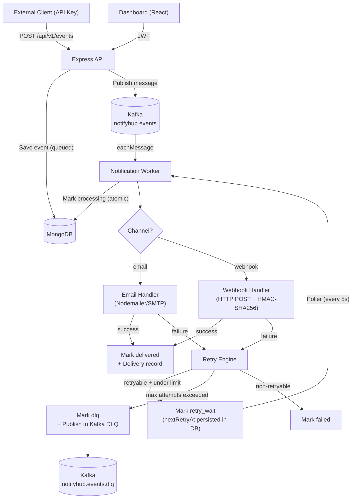

# NotifyHub

A multi-tenant, event-driven notification and webhook delivery platform built on Node.js, Kafka, and MongoDB.

## Architecture



## Features

| Feature | Status |
|---|---|
| Multi-tenant isolation | ✅ |
| JWT authentication | ✅ |
| API key authentication (scoped) | ✅ |
| Email delivery (Nodemailer) | ✅ |
| Webhook delivery (real HTTP POST + HMAC-SHA256) | ✅ |
| Retry with exponential backoff + jitter | ✅ |
| Dead Letter Queue (Kafka DLQ topic) | ✅ |
| Rate limiting (auth + API + per-tenant events) | ✅ |
| Real Kafka health check | ✅ |
| Structured JSON worker logging | ✅ |
| Graceful shutdown | ✅ |

## Quick Start

### Prerequisites
- Docker & Docker Compose
- Node.js 18+

### 1. Start infrastructure

```bash
docker-compose up -d
```

### 2. Configure environment

```bash
cp Backend/.env.example Backend/.env
# Edit Backend/.env with your SMTP credentials
```

### 3. Start the API

```bash
cd Backend && npm run dev
```

### 4. Start the Worker

```bash
cd Backend && npm run worker
```

### 5. Start the Frontend

```bash
cd Frontend && npm run dev
```

## Environment Variables

See [`Backend/.env.example`](Backend/.env.example) for the full reference.

### Key variables for new features

| Variable | Default | Description |
|---|---|---|
| `MAX_DELIVERY_ATTEMPTS` | `5` | Total attempts before DLQ |
| `RETRY_BASE_DELAY_MS` | `1000` | Base delay for exponential backoff |
| `RETRY_MAX_DELAY_MS` | `300000` | Maximum retry delay (5 min) |
| `RETRY_POLLER_INTERVAL_MS` | `5000` | How often retry poller runs |
| `KAFKA_DLQ_TOPIC` | `notifyhub.events.dlq` | DLQ Kafka topic name |
| `WEBHOOK_TIMEOUT_MS` | `10000` | Webhook HTTP request timeout |
| `WEBHOOK_ALLOW_LOCALHOST` | `false` | Allow localhost webhook targets (dev only) |

## Webhook Delivery

NotifyHub delivers events to tenant-configured webhook endpoints via real HTTP POST.

### Payload format

```json
{
  "eventId": "...",
  "eventType": "user.created",
  "tenantId": "...",
  "channel": "webhook",
  "data": { ... },
  "timestamp": "2024-01-01T00:00:00.000Z"
}
```

### HMAC-SHA256 Signing

Every request includes `X-NotifyHub-Signature: sha256=<hex>` if a webhook secret is configured.

To verify on your receiver:
```js
const crypto = require('crypto');
const expected = 'sha256=' + crypto.createHmac('sha256', YOUR_SECRET)
  .update(rawBody).digest('hex');
const isValid = expected === req.headers['x-notifyhub-signature'];
```

### Configure via API

```bash
PATCH /api/v1/tenant/webhook
Authorization: Bearer <jwt>
Content-Type: application/json

{
  "webhookUrl": "https://your-app.com/webhooks/notifyhub",
  "webhookSecret": "your-secret-min-16-chars"
}
```

> **Security**: `webhookSecret` is stored on the server and never returned in API responses.

### SSRF Protection

Webhook delivery to `localhost`, `127.x.x.x`, `10.x.x.x`, `192.168.x.x`, and other private ranges is **blocked by default**.

Set `WEBHOOK_ALLOW_LOCALHOST=true` in local development to allow local test servers.

## Retry Behavior

Failed deliveries are automatically retried with exponential backoff and full jitter:

```
delay = random(0, min(BASE * 2^(attempt-1), MAX))
```

| Attempt | Max delay (default config) |
|---|---|
| 1st retry | 0–1s |
| 2nd retry | 0–2s |
| 3rd retry | 0–4s |
| 4th retry | 0–8s |

**Retry state is persisted in MongoDB** — retries survive worker restarts.

### Retryable errors
- HTTP 408, 429, 5xx
- Timeout
- Network errors (ECONNREFUSED, ECONNRESET, ETIMEDOUT)

### Non-retryable errors
- HTTP 400, 401, 403
- Invalid webhook URL
- Missing tenant webhook configuration
- Malformed payload

## Dead Letter Queue (DLQ)

When an event exhausts all retry attempts, it transitions to `dlq` status:

1. Event status in MongoDB → `dlq`
2. DLQ record published to `notifyhub.events.dlq` Kafka topic

DLQ messages include:
```json
{
  "eventId": "...",
  "tenantId": "...",
  "channel": "webhook",
  "attempts": 5,
  "reason": "HTTP 500",
  "lastError": "...",
  "originalTopic": "notifyhub.events",
  "failedAt": "..."
}
```

> **Safety**: DLQ Kafka publish failures are logged but do NOT crash the worker. The event is still marked `dlq` in MongoDB.

## Rate Limiting

| Endpoint category | Limit | Window |
|---|---|---|
| `POST /auth/login`, `POST /auth/register` | 10 requests | 15 minutes per IP |
| All `/api/v1/*` routes | 100 requests | 1 minute per IP |
| `POST /api/v1/events` (event publishing) | 60 requests | 1 minute per API key |
| `/health`, `/health/kafka` | Unlimited | — |

Returns `HTTP 429` with:
```json
{ "success": false, "message": "Too many requests — please try again later" }
```

> **Production note**: The current in-memory rate limiter is suitable for single-instance deployments. For multi-instance production, replace with a Redis-backed store (`rate-limit-redis`).

## Kafka Health Check

```
GET /health/kafka
```

Performs a real broker connectivity probe (cached 30s):

```json
{
  "success": true,
  "kafka": {
    "status": "healthy",
    "broker": "localhost:9092",
    "latencyMs": 12,
    "cached": false
  }
}
```

Returns `503` with `status: "unhealthy"` when Kafka is unreachable.

## Running Tests

```bash
cd Backend

# Run all tests
npm test

# Watch mode
npm run test:watch

# With coverage
npm run test:coverage
```

### Test categories

| Test file | What it covers |
|---|---|
| `webhook.test.js` | Real HTTP POST, HMAC signing, timeout, retryability |
| `retry.test.js` | Backoff calculation, error classification |
| `dlq.test.js` | DLQ transition safety, publish failure handling |
| `kafkaHealth.test.js` | Healthy/unhealthy reporting, timeout, no credential leaks |
| `rateLimiting.test.js` | Auth limits, health endpoint not blocked |
| `tenantIsolation.test.js` | Cross-tenant access prevented at service layer |

## API Reference

### Authentication
```
POST /api/v1/auth/register
POST /api/v1/auth/login
GET  /api/v1/auth/me
POST /api/v1/auth/change-password
```

### Tenant Management
```
GET   /api/v1/tenant
PATCH /api/v1/tenant
PATCH /api/v1/tenant/webhook      # Configure webhook URL + secret
GET   /api/v1/tenant/members
POST  /api/v1/tenant/members
GET   /api/v1/tenant/members/:id
PATCH /api/v1/tenant/members/:id
```

### Events
```
POST /api/v1/events               # Publish event (API key required)
GET  /api/v1/events               # List events (JWT required)
GET  /api/v1/events/:id           # Get event detail (JWT required)
```

### Health
```
GET /health
GET /health/kafka
```

## Event Status Flow

```
queued → processing → delivered
queued → processing → retry_wait → processing → delivered
queued → processing → retry_wait → ... → dlq
queued → processing → failed (non-retryable)
```

## Security

- API keys hashed with SHA-256 (raw key never stored)
- Passwords hashed with bcrypt (cost 12)
- JWT authentication on all dashboard routes
- Webhook secrets stored with `select: false` — never returned in API responses
- HMAC-SHA256 webhook signing
- SSRF protection on webhook URLs (blocks private IP ranges)
- Rate limiting on authentication endpoints
- Tenant isolation enforced at service and DB query layers
