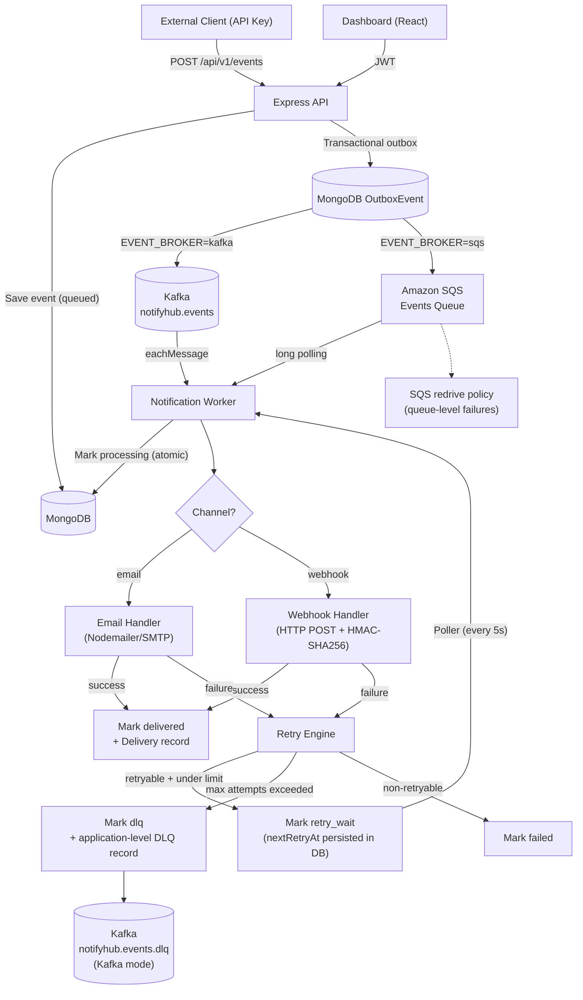

# NotifyHub

A multi-tenant, event-driven notification and webhook delivery platform built on Node.js, Kafka/SQS, and MongoDB.

## Architecture



### Event broker modes

Local Docker development uses the existing Kafka path:

```text
API → MongoDB Event + OutboxEvent → Kafka → Worker
```

AWS/ECS can select SQS without changing the transactional outbox or delivery
state machine:

```text
API → MongoDB Event + OutboxEvent → SQS → Worker
```

Set `EVENT_BROKER=kafka` (the default) locally. For AWS, set
`EVENT_BROKER=sqs`, `AWS_REGION`, and `SQS_EVENTS_QUEUE_URL`. The SQS adapter
uses the ECS task IAM role through the AWS SDK default credential provider
chain; credentials are never configured in application environment files.

SQS long polling leaves a failed message undeleted so its visibility timeout
expires. The queue redrive policy then moves it to the configured SQS DLQ.
NotifyHub's existing MongoDB delivery retry state machine remains separate and
continues to retry individual email/webhook deliveries. In Kafka mode, the
existing application-level Kafka DLQ topic is preserved. If per-tenant ordering
is required in SQS mode, use a FIFO queue URL ending in `.fifo`; the adapter
uses `tenantId` as `MessageGroupId` and `eventId` as the deduplication ID.

## Features

| Feature | Status |
|---|---|
| Multi-tenant isolation | ✅ |
| JWT authentication | ✅ |
| API key authentication (scoped) | ✅ |
| Email delivery (Nodemailer) | ✅ |
| Webhook delivery (real HTTP POST + HMAC-SHA256) | ✅ |
| Retry with exponential backoff + jitter | ✅ |
| Dead Letter Queue (Kafka DLQ topic) | ✅ |
| Rate limiting (auth + API + per-tenant events) | ✅ |
| Real Kafka health check | ✅ |
| Structured JSON worker logging | ✅ |
| Graceful shutdown | ✅ |

## Quick Start

### Prerequisites
- Docker & Docker Compose
- Node.js 18+

### 1. Start infrastructure

```bash
docker-compose up -d
```

### 2. Configure environment

```bash
cp Backend/.env.example Backend/.env
# Edit Backend/.env with your SMTP credentials
```

### 3. Start the API

```bash
cd Backend && npm run dev
```

### 4. Start the Worker

```bash
cd Backend && npm run worker
```

### 5. Start the Frontend

```bash
cd Frontend && npm run dev
```

## Environment Variables

See [`Backend/.env.example`](Backend/.env.example) for the full reference.

For the temporary single-EC2 Kafka demo deployment, see
[`docs/kafka-ec2.md`](docs/kafka-ec2.md) and
[`docker-compose.kafka-ec2.yml`](docker-compose.kafka-ec2.yml).

### Key variables for new features

| Variable | Default | Description |
|---|---|---|
| `MAX_DELIVERY_ATTEMPTS` | `5` | Total attempts before DLQ |
| `RETRY_BASE_DELAY_MS` | `1000` | Base delay for exponential backoff |
| `RETRY_MAX_DELAY_MS` | `300000` | Maximum retry delay (5 min) |
| `RETRY_POLLER_INTERVAL_MS` | `5000` | How often retry poller runs |
| `KAFKA_DLQ_TOPIC` | `notifyhub.events.dlq` | DLQ Kafka topic name |
| `EVENT_BROKER` | `kafka` | Event transport: `kafka` or `sqs` |
| `SQS_EVENTS_QUEUE_URL` | — | AWS SQS event queue (required in SQS mode) |
| `SQS_WAIT_TIME_SECONDS` | `20` | SQS long-poll duration |
| `SQS_VISIBILITY_TIMEOUT_SECONDS` | `60` | Visibility timeout for worker processing |
| `SQS_MAX_MESSAGES` | `10` | Maximum messages received per SQS poll |
| `WEBHOOK_TIMEOUT_MS` | `10000` | Webhook HTTP request timeout |
| `WEBHOOK_ALLOW_LOCALHOST` | `false` | Allow localhost webhook targets (dev only) |
| `REDIS_URL` | `redis://localhost:6379` | Shared Redis endpoint for rate limiting; required in production |
| `RATE_LIMIT_FAILURE_MODE` | `fail-open` | Redis-outage policy: `fail-open` or `fail-closed` |

## Webhook Delivery

NotifyHub delivers events to tenant-configured webhook endpoints via real HTTP POST.

### Payload format

```json
{
  "eventId": "...",
  "eventType": "user.created",
  "tenantId": "...",
  "channel": "webhook",
  "data": { ... },
  "timestamp": "2024-01-01T00:00:00.000Z"
}
```

### HMAC-SHA256 Signing

Every request includes `X-NotifyHub-Signature: sha256=<hex>` if a webhook secret is configured.

To verify on your receiver:
```js
const crypto = require('crypto');
const expected = 'sha256=' + crypto.createHmac('sha256', YOUR_SECRET)
  .update(rawBody).digest('hex');
const isValid = expected === req.headers['x-notifyhub-signature'];
```

### Configure via API

```bash
PATCH /api/v1/tenant/webhook
Authorization: Bearer <jwt>
Content-Type: application/json

{
  "webhookUrl": "https://your-app.com/webhooks/notifyhub",
  "webhookSecret": "your-secret-min-16-chars"
}
```

> **Security**: `webhookSecret` is stored on the server and never returned in API responses.

### SSRF Protection

Webhook delivery to `localhost`, `127.x.x.x`, `10.x.x.x`, `192.168.x.x`, and other private ranges is **blocked by default**.

Set `WEBHOOK_ALLOW_LOCALHOST=true` in local development to allow local test servers.

## Retry Behavior

Failed deliveries are automatically retried with exponential backoff and full jitter:

```
delay = random(0, min(BASE * 2^(attempt-1), MAX))
```

| Attempt | Max delay (default config) |
|---|---|
| 1st retry | 0–1s |
| 2nd retry | 0–2s |
| 3rd retry | 0–4s |
| 4th retry | 0–8s |

**Retry state is persisted in MongoDB** — retries survive worker restarts.

### Retryable errors
- HTTP 408, 429, 5xx
- Timeout
- Network errors (ECONNREFUSED, ECONNRESET, ETIMEDOUT)

### Non-retryable errors
- HTTP 400, 401, 403
- Invalid webhook URL
- Missing tenant webhook configuration
- Malformed payload

## Dead Letter Queue (DLQ)

When an event exhausts all retry attempts, it transitions to `dlq` status:

1. Event status in MongoDB → `dlq`
2. DLQ record published to `notifyhub.events.dlq` Kafka topic

DLQ messages include:
```json
{
  "eventId": "...",
  "tenantId": "...",
  "channel": "webhook",
  "attempts": 5,
  "reason": "HTTP 500",
  "lastError": "...",
  "originalTopic": "notifyhub.events",
  "failedAt": "..."
}
```

> **Safety**: DLQ Kafka publish failures are logged but do NOT crash the worker. The event is still marked `dlq` in MongoDB.

## Rate Limiting

NotifyHub uses Redis-backed token buckets, shared by all API instances. Each bucket has a sustained rate and an independent burst capacity; counters expire automatically after inactivity.

| Scope | Default sustained rate | Default burst | Purpose |
|---|---:|---:|---|
| Authentication IP | 10 / 15 min | 10 | Brute-force protection |
| API IP | 1000 req/s | 2000 | Source abuse protection |
| Event global | 1000 events/s | 2000 | Cluster safety ceiling |
| Event tenant | 1000 events/s | 2000 | Tenant capacity isolation |
| Event API key | 1000 events/s | 2000 | Credential-level isolation |

Event publishing checks global, tenant, and API-key buckets atomically. Two API keys of the same tenant therefore share the tenant quota, while different tenants are isolated. Tenant records may set `ingestionRateLimit.eventsPerSecond` and `ingestionRateLimit.burst` to override the tenant defaults without code changes; updates are applied after the bounded quota-cache TTL.

Redis keys contain only a one-way hash of IP, tenant ID, or API-key ID—not raw credentials or request headers. Redis uses `REDIS_URL`; use an authenticated `rediss://` endpoint in production. The included Docker Compose Redis service is development-only and has no authentication.

Express ignores `X-Forwarded-For` unless `TRUST_PROXY` is explicitly configured with known proxy IPs/CIDRs. Do not set it to a broad value in production.

If Redis is unavailable, `RATE_LIMIT_FAILURE_MODE=fail-open` preserves API availability but temporarily removes quota enforcement. `fail-closed` returns HTTP 503 and protects capacity. Choose and document that tradeoff per deployment. `/health` remains liveness-only; `/health/redis` exposes Redis dependency readiness.

The default event limits are candidate capacity settings, not throughput proof. Run the staged k6 load test before treating 1,000 events/s as a supported production result.

Rate-limited requests return `429` with `Retry-After`, `RateLimit-Remaining`, and `RateLimit-Reset` headers:
```json
{ "success": false, "message": "Too many requests — please try again later" }
```

## Kafka Health Check

`/health/kafka` remains available for compatibility. In `EVENT_BROKER=kafka`
it performs the existing live Kafka probe. In `EVENT_BROKER=sqs`, it returns a
successful `not_configured` Kafka status with `broker: "sqs"`; SQS mode does not
require Kafka connectivity.

## Kafka topic contract

Deployment tooling—not the API or worker—must provision Kafka topics. The worker validates that the following topics already exist and meet their minimum partition counts:

| Topic | Local partitions | Local replication | Purpose |
|---|---:|---:|---|
| `KAFKA_TOPIC` (`notifyhub.events`) | 6 | 1 | Event ingestion; tenant ID is the key to preserve per-tenant ordering |
| `KAFKA_DLQ_TOPIC` (`notifyhub.events.dlq`) | 1 | 1 | Poisoned/exhausted delivery records |

Production must set partition, replication, `min.insync.replicas`, retention, and cleanup policy declaratively in its Kafka deployment. The one-broker Compose environment is not a production replication model.

## Delivery tenant migration

Before deploying the required `Delivery.tenantId` field against existing data, first run `node Backend/src/scripts/backfill-delivery-tenant-id.js` for a dry run and then rerun with `--apply`. Investigate any `unresolved` records; the script never deletes data.

```
GET /health/kafka
```

Performs a real broker connectivity probe (cached 30s):

```json
{
  "success": true,
  "kafka": {
    "status": "healthy",
    "broker": "localhost:9092",
    "latencyMs": 12,
    "cached": false
  }
}
```

Returns `503` with `status: "unhealthy"` when Kafka is unreachable.

## Running Tests

```bash
cd Backend

# Run all tests
npm test

# Watch mode
npm run test:watch

# With coverage
npm run test:coverage
```

### Test categories

| Test file | What it covers |
|---|---|
| `webhook.test.js` | Real HTTP POST, HMAC signing, timeout, retryability |
| `retry.test.js` | Backoff calculation, error classification |
| `dlq.test.js` | DLQ transition safety, publish failure handling |
| `kafkaHealth.test.js` | Healthy/unhealthy reporting, timeout, no credential leaks |
| `rateLimiting.test.js` | Auth limits, health endpoint not blocked |
| `tenantIsolation.test.js` | Cross-tenant access prevented at service layer |

## API Reference

### Authentication
```
POST /api/v1/auth/register
POST /api/v1/auth/login
GET  /api/v1/auth/me
POST /api/v1/auth/change-password
```

### Tenant Management
```
GET   /api/v1/tenant
PATCH /api/v1/tenant
PATCH /api/v1/tenant/webhook      # Configure webhook URL + secret
GET   /api/v1/tenant/members
POST  /api/v1/tenant/members
GET   /api/v1/tenant/members/:id
PATCH /api/v1/tenant/members/:id
```

### Events
```
POST /api/v1/events               # Publish event (API key required)
GET  /api/v1/events               # List events (JWT required)
GET  /api/v1/events/:id           # Get event detail (JWT required)
```

### Health
```
GET /health
GET /health/kafka
GET /health/redis
```

## Event Status Flow

```
queued → processing → delivered
queued → processing → retry_wait → processing → delivered
queued → processing → retry_wait → ... → dlq
queued → processing → failed (non-retryable)
```

## Security

- API keys hashed with SHA-256 (raw key never stored)
- Passwords hashed with bcrypt (cost 12)
- JWT authentication on all dashboard routes
- Webhook secrets stored with `select: false` — never returned in API responses
- HMAC-SHA256 webhook signing
- SSRF protection on webhook URLs (blocks private IP ranges)
- Rate limiting on authentication endpoints
- Tenant isolation enforced at service and DB query layers
